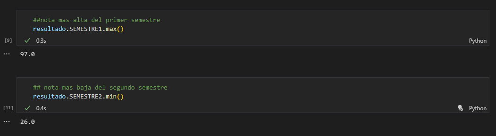
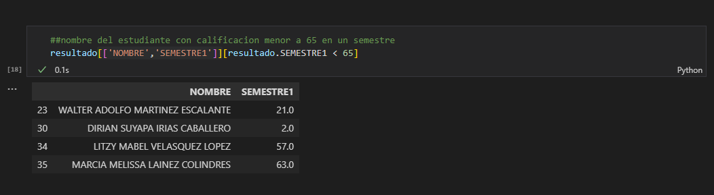
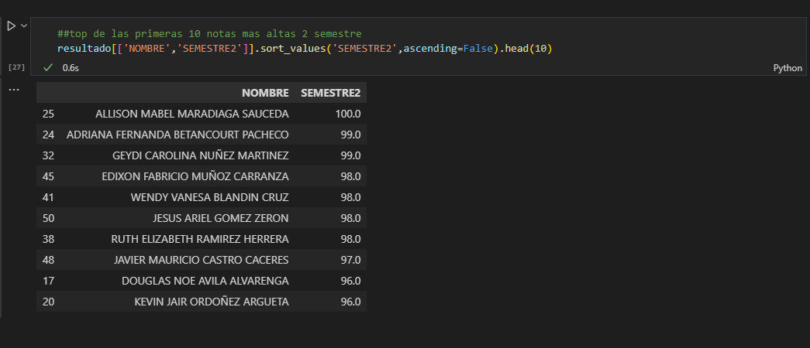

# Creacion de un DataFrame
## TAREA 1
### IS-701 Inteligencia Artificial
- Nombre: Andrea Michelle Calix Gonzalez
- Cuenta: 20171000581
- Seccion: 1700

## Data Utilizada
Para la realizacion de esta tarea se tomo data de un cuadro de calificaciones divido en columnas (nombre,nota semestre 1, nota semestre 2), con el objetivo de responder preguntas del negocio como las definidas acontinuacion:

### Preguntas del Negocio:
- Promedio de notas (semestre 1, semestre 2 y promedio total de ambos semestres)
- Nota mas alta de un semestre
- Nota mas baja de un semestre
- Top 10, notas mas altas en un semestre
- Cantidad de notas superiores o iguales a 65
- Estudiantes con calificaciones menores a 65

## Recursos
- [Evidencia](Evidencia) esta carpeta contiene imagenes del proceso de realizacion de la tarea
- [Data](Data) esta carpeta contiene los archivoc .json y csv 
- [tarea.ipynb](tarea.ipynb) ejecutable de la tarea

## Demostracion de funcionamiento
Cantidad de notas superiores o iguales a 65

Nota mas alta de un semestre y Nota mas baja de un semestre

Estudiantes con calificaciones menores a 65

Top 10, notas mas altas en un semestre

Promedio de notas (semestre 1, semestre 2 y promedio total de ambos semestres)
.png)
